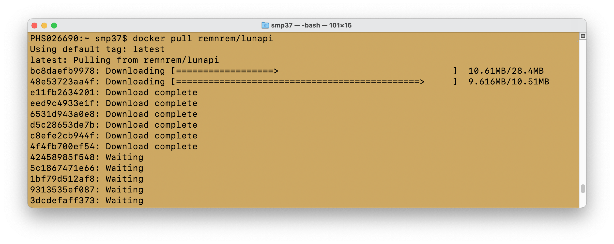
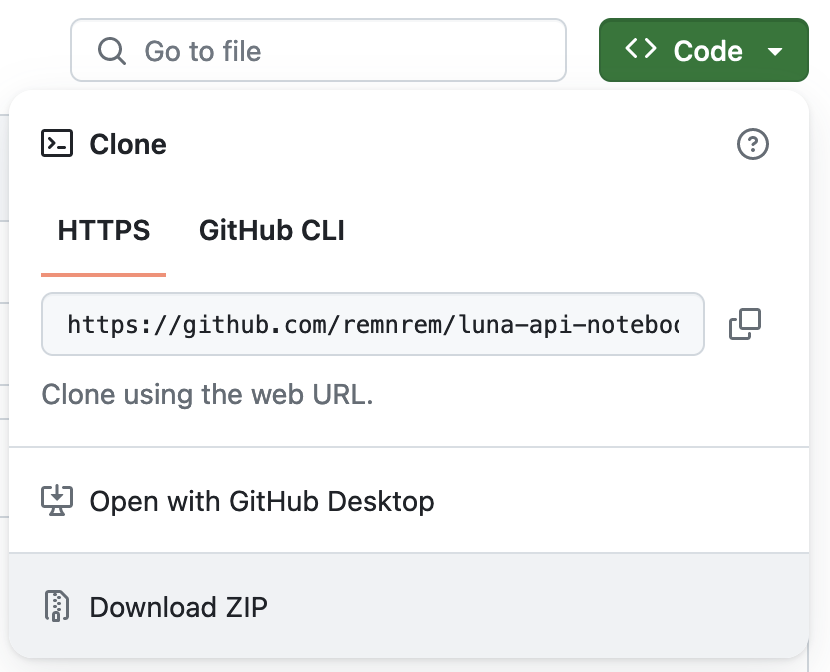
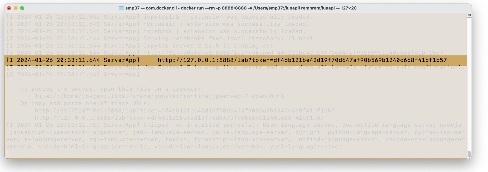
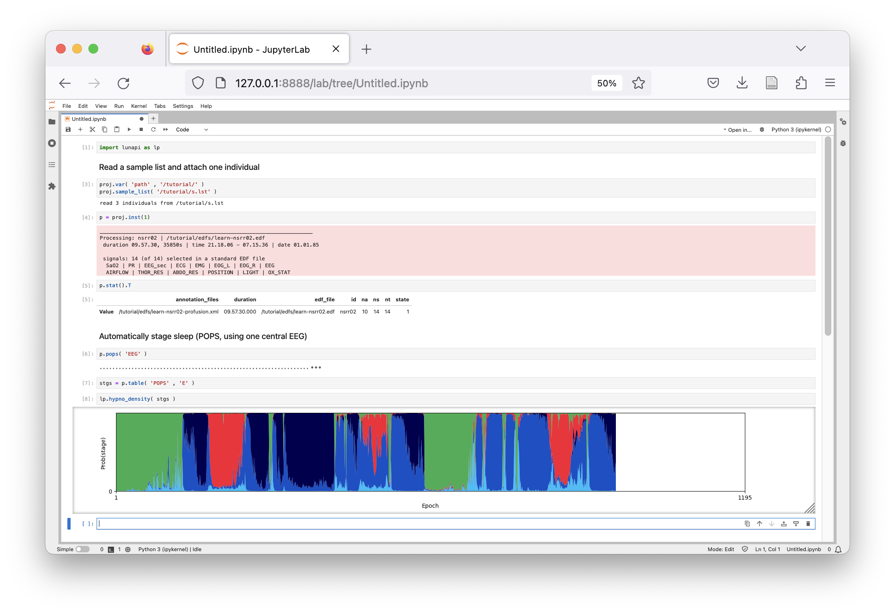

# LunAPI: A Python interface for Luna

This repository contains tutorial and reference notebooks for LunAPI
(pronounced _luna-py_), a Python-based interface for the Luna C/C++
toolset for the analysis of sleep signal data.

## Get started

While we develop the `lunapi` Python package, we will suppo

### 1) Install Docker Desktop

### 2) Pull the latest LunAPI image

### 3) Get the tutorial and reference notebooks

### 4) Start LunAPI 

Move to the folder you downloaded the notebooks to and start _LunAPI_.

This will start a container running a Jupyter Lab notebook environment, with Luna and
associated data and models all pre-installed. 

## More information

The main Luna documentation pages can be found at
[http://zzz.bwh.harvard.edu], which describes how to work with Luna,
its command scripting language and the range of commands available.

Currently, all documentation related to the Python interface
(specifically _LunAPI_, or the Python package `lunapi`) are in the
Jupyter notebooks in this repository.

