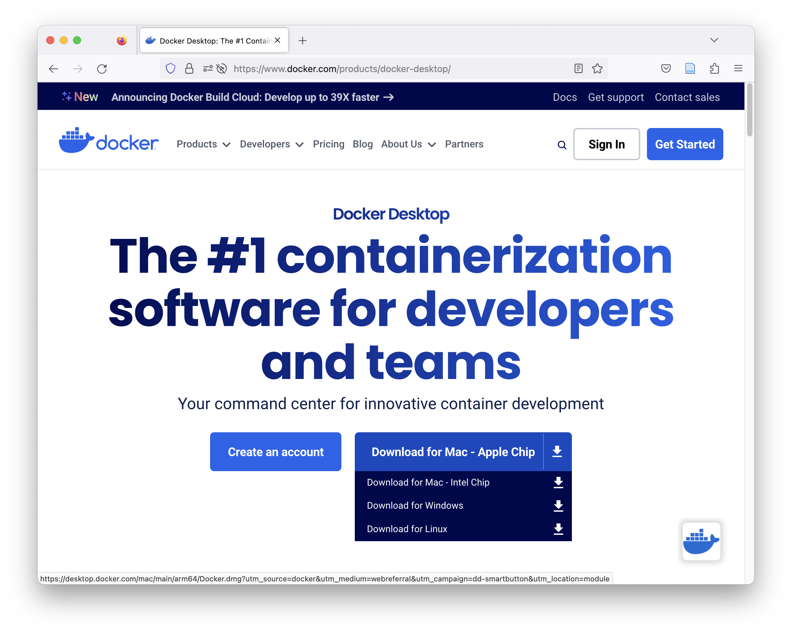
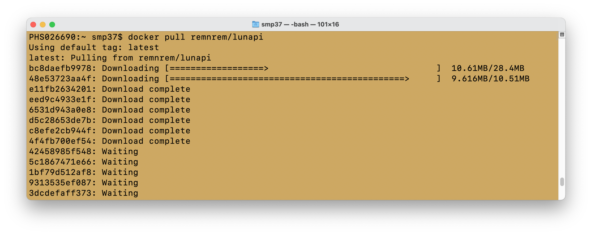
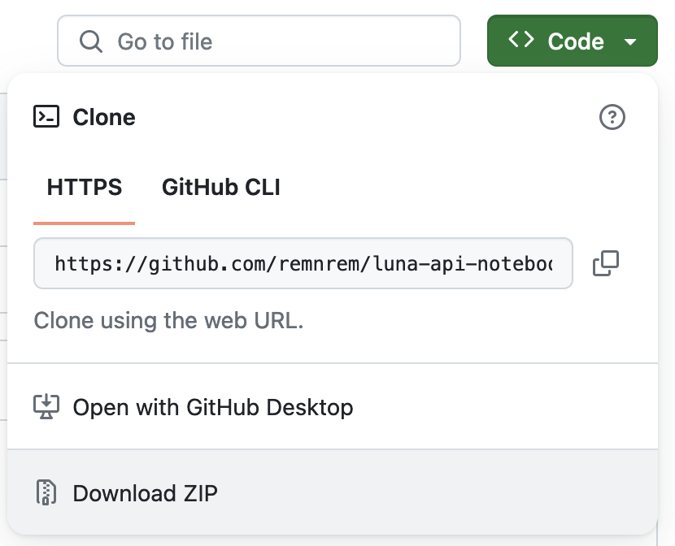
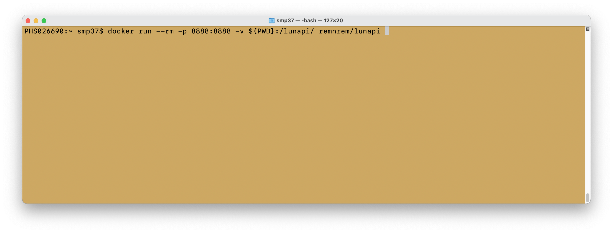
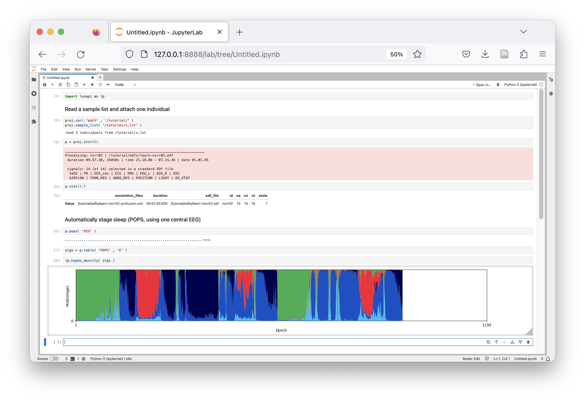

# LunAPI: A Python interface for Luna

[](https://mybinder.org/v2/gh/remnrem/luna-api-notebooks/HEAD?urlpath=%2Fdoc%2Ftree%2F00_overview.ipynb)

This repository contains tutorial and reference notebooks for LunAPI
(pronounced _luna-py_), a Python-based interface for the
[Luna](http://zzz.bwh.harvard.edu/luna/) C/C++ toolset for the
analysis of sleep signal data.

## Getting started

Although some binary wheels are available via
[PyPI](https://pypi.org/project/lunapi/) for macOS (Intel and Silicon
chips) and Linux (Intel x86_64), while we develop the `lunapi` Python
package, we are primarily supporting a Docker-based installation.
This ensures that the same functionality is available on all platforms
(Windows, macOS and Linux) and allows `lunapi` to be bundled with a
set of associated models and resources (e.g. tutorial data, staging
models, etc) embedded within a Jupyter Lab interactive notebook
environment.

> [!NOTE]
> Experienced users are free to compile the project locally
> (i.e. pre-installing [Luna](http://github.com/remnrem/luna-base) and
> [LunaAPI](http://github.com/remnrem/luna-api) and invoking
> the scikit-build-core/CMake build system).  Installation notes will be
> added to the `luna-api` repo in time.


### pip installation

To install using `pip` (on macOS, Windows or Linux distributions) you can try:

```
pip install lunapi
```

If this works, download this current repository contents and start up
the notebooks by running `jupyter lab` in the root directory of the
download (naturally, you must must install
[JupyterLab](https://jupyter.org/) if you haven't already).

If this doesn't support your current platform/Python installation, you
should use the Docker image (below).  There are no source wheels
currently distributed: we'll look to adding these for Linux in due
course.


### Docker installation

There are four easy steps:

 - Install [Docker Desktop](http://www.docker.com)

 - Pull the `lunapi` Docker image:
   ```
   docker pull remnrem/lunapi
   ```

 - Grab the notebooks in this repo, and change into it:
   ```
   git clone https://github.com/remnrem/luna-api-notebooks.git
   cd luna-api-notebooks
   ```

 - Fire up a container with Jupyter Lab — see [Step 4](#4-start-lunapi) below for options.

See the notes below for more details.


### 1) Install Docker Desktop

First, download a free copy of [Docker Desktop](http://www.docker.com)
for your machine.  If using a Mac, be sure to select the correct chip
type (Apple vs Intel).

<p align="center" width="100%">
 
</p>

There is plenty of help on the Docker pages if you get stuck.

### 2) Pull the latest LunAPI image

After installing Docker, use the command line to _pull_ the latest version
of `lunapi`:

```
docker pull remnrem/lunapi
```

<p align="center" width="100%">
 
</p>

> [!TIP]
> You can always use this command subsequently to check that the version you are using
> is up-to-date.


### 3) Get the tutorial and reference notebooks

Next, get the tutorial and reference notebooks from this repository. These are not required
but will be helpful to get you started.   For example, you can use `git clone` from the command line,
or simply download a Zip file from the links at the top of this page:

<p align="center" width="100%">
 
</p>

### 4) Start LunAPI

Move to the folder where you downloaded the notebooks (`luna-api-notebooks/`)
and start _LunAPI_. This is the step you repeat at the beginning of each session.
There are two options:

#### Option A — Auto-launch script (recommended)

The `start.py` script included in this repository starts the container, waits
until Jupyter Lab is ready, and **opens your browser automatically** — no
copy-pasting required.  It works on macOS, Linux, and Windows, and requires
only Python (which you already have if you are using Jupyter):

```
python start.py
```

To use a specific data folder instead of the current directory, pass it as an argument:
```
python start.py /path/to/your/data
```

Press **Ctrl-C** to stop the container when you are done.

#### Option B — Manual docker command

If you prefer to run Docker directly, the image sets a fixed token so the URL
is always the same:

  - on macOS or Linux:
    ```
    docker run --rm -p 8888:8888 -v ${PWD}:/lunapi/ remnrem/lunapi
    ```

  - on Windows:
    ```
    docker run --rm -p 8888:8888 -v %cd%:/lunapi/ remnrem/lunapi
    ```

Then open your browser and go to:
```
http://127.0.0.1:8888/lab?token=lunapi
```

> [!TIP]
> Bookmark that URL — it will be the same every time you use Option B.
> You can override the token at runtime with `-e JUPYTER_TOKEN=mytoken`
> if you need a different one.

<p align="center" width="100%">
 
</p>

> [!NOTE]
> See the Docker documentation for more details on using
> Docker.  The `docker run` command 1) stops the container when you finish (`--rm`), 2) maps port
> 8888 from the container to port 8888 on your machine so that you
> can access Jupyter Lab via your local web browser, and 3) maps the
> current folder on your local machine to the folder
> `/lunapi/` in the container so that you can read/write files to
> your machine from the container.  It is easy to map multiple folders (or specify a
> folder other than the working directory, e.g. `-v
> /home/john/data/:/lunapi/` using the form `local:container`), etc.
> One tip is that it is better not to map your whole home folder for
> performance reasons.

After launching via either option you should see an instance of Jupyter Lab
running and ready to start analysis! For example, here we first `import lunapi as lp` and then run
the POPS automated stager on an NSRR tutorial EDF:

<p align="center" width="100%">
 
</p>

For more details, open the notebooks (`.ipynb` files) to follow the tutorial and reference material for `lunapi`.  

Keep the terminal window open (can be backgrounded) in order to keep the Jupyter Lab instance
running locally on your machine.  You should be able to close the Jupyter Lab instance by pressing Ctrl-C
on the terminal where you initiated it.  (On Windows, this may not work: if so, you can always use the Docker Desktop
to close any containers.)


> [!CAUTION]
> Without altering configuration files, you can only have a single instance of Jupyter Lab and LunAPI container running
> at any one time.

## More information

The main Luna documentation pages can be found at
[http://zzz.bwh.harvard.edu/luna](http://zzz.bwh.harvard.edu/luna), which describes how to work with Luna,
its command scripting language and the range of analyses available.

Currently, all documentation related to the Python interface
(i.e. _LunAPI_, equivalently termed as the Python package `lunapi`)
are in the Jupyter notebooks in this repository.
